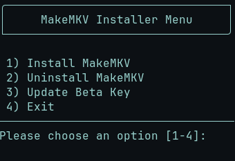
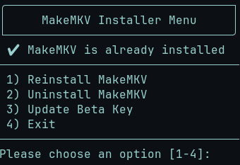

<h1 align="center">MakeMKV</h1>

  <strong>Automated MakeMKV installation and activation script</strong> for Linux distributions.
  This utility streamlines the setup process by automatically installing all dependencies,
  downloading official MakeMKV archives, and managing license activation across multiple distributions.

<h2>Menu Preview</h2>
 

<h2>Features</h2>

<ul>
  <li><strong>Automatic Dependency Installation</strong> - Detects and installs all required packages for your distribution</li>
  <li><strong>Official Archive Download</strong> - Fetches the latest OSS and binary archives directly from the official MakeMKV website</li>
  <li><strong>Fast Setup Process</strong> - Optimized workflow reduces manual configuration and build time</li>
  <li><strong>License Activation</strong> - Activate your existing MakeMKV license directly from the script</li>
  <li><strong>Multi-Distribution Support</strong> - Currently supports Arch and Fedora, with Debian/Ubuntu support coming soon</li>
  <li><strong>Flexible Installation Options</strong> - Choose between fresh installation or activation of existing versions</li>
</ul>

<h2>Supported Distributions</h2>

<table>
  <tr>
    <th>Distribution</th>
    <th>Status</th>
  </tr>
  <tr>
    <td>Arch Linux</td>
    <td>✅ Fully Supported</td>
  </tr>
  <tr>
    <td>Fedora</td>
    <td>✅ Fully Supported</td>
  </tr>
  <tr>
    <td>Debian/Ubuntu</td>
    <td>🔄 Coming Soon</td>
  </tr>
</table>

<h2>Quick Start</h2>

Clone the repository and run the installation script:

<pre><code>git clone https://github.com/MRCYODev/makemkv.git
cd makemkv
chmod +x makemkv.sh
./makemkv.sh</code></pre>
----
> [!IMPORTANT]
> During the installation process, you will be presented with the MakeMKV End User License Agreement (**``src/eula_en_linux.txt``**).
> To accept the license terms and continue with the installation, **press `q`** to exit the license viewer.
> This is a required step to proceed with MakeMKV setup.

<h2>How It Works</h2>

<ol>
  <li><strong>Distribution Detection</strong> - Automatically identifies your Linux distribution (Arch/Fedora/Debian)</li>
  <li><strong>Dependency Resolution</strong> - Installs all required build tools and libraries specific to your system</li>
  <li><strong>Archive Download</strong> - Fetches the latest official MakeMKV OSS and binary archives from the source</li>
  <li><strong>EULA Acceptance</strong> - The MakeMKV EULA (<code>src/eula_en_linux.txt</code>) will be displayed during installation. <strong>Press <code>q</code> to exit the viewer and accept the terms</strong></li>
  <li><strong>Compilation & Installation</strong> - Builds and installs MakeMKV</li>
  <li><strong>License Management</strong> - Provides options to activate your existing license key</li>
</ol>

<h2>Requirements</h2>

<ul>
  <li>Linux operating system (Arch, Fedora, or Debian/Ubuntu)</li>
  <li>Internet connection for downloading archives</li>
  <li>Sudo privileges for installing system packages</li>
</ul>

<h2>Installation Methods Comparison</h2>

<table>
  <tr>
    <th>Method</th>
    <th>Speed</th>
    <th>Efficiency</th>
    <th>Customization</th>
  </tr>
  <tr>
    <td>My Script</td>
    <td>✨ Very Fast</td>
    <td>✅ High</td>
    <td>💪 Flexible</td>
  </tr>
  <tr>
    <td>Manual Installation</td>
    <td>🐢 Slow</td>
    <td>⏰ Time-consuming</td>
    <td>⚠️ Complex</td>
  </tr>
  <tr>

  </tr>
</table>

<h2>Troubleshooting</h2>

<strong>Permission Denied Error:</strong>

<pre><code>chmod +x makemkv.sh</code></pre>

<strong>Unsupported Distribution:</strong>

Ensure you're running on Arch, Fedora, or Debian/Ubuntu. Other distributions may require manual configuration.

<strong>EULA Viewer Not Responding:</strong>

If the EULA viewer appears stuck, press <code>q</code> to exit and accept the terms to continue with installation.

<h2>License</h2>

  This project is licensed under the <strong>MIT License</strong> - see the
  <a href="LICENSE">LICENSE</a> file for details.

  MakeMKV itself is governed by its own license terms. Please refer to the official
  <a href="https://www.makemkv.com">MakeMKV website</a> for licensing information.

<h2>Contributing ⭐</h2>

Found a bug? [Open an issue](https://github.com/MRCYODev/makemkv/issues)
Have a feature idea? [Report it here](https://github.com/MRCYODev/makemkv/issues)
Ready to code? Fork the repo and submit a pull request!
